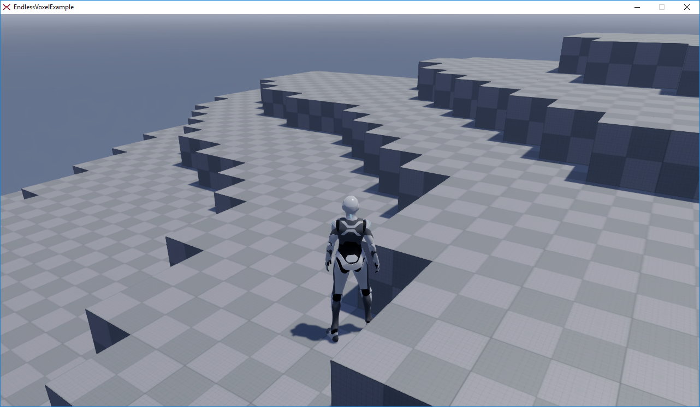

Endless Voxel Terrain Example
===================

This is a small example illustrating the basics of an endless terrain generation in the [Xenko](https://xenko.com) Game Engine. It has been made as concise as possible, to transport the basic idea.

It is based on the [ThirdPerson](https://xenko.com/blog/game-templates/) template. It has mainly two parts: The visible voxel management in the [WorldGenerator](https://github.com/jason-wilmans/XenkoVoxelExample/blob/master/EndlessVoxelExample/EndlessVoxelExample.Game/World/WorldGenerator.cs) class and the terrain generation in the [TerrainGenerator](https://github.com/jason-wilmans/XenkoVoxelExample/blob/master/EndlessVoxelExample/EndlessVoxelExample.Game/World/TerrainGenerator.cs) class.

Especially the terrain generation is nothing more than a simple placeholder for an adequate logic. But it illustrates the concept of a generator function, which returns a height for a given space in the voxel grid. Here it is a mixture of overlapping sine and cosine waves with different wavelengths and amplitudes.

Its output is used in the [WorldGenerator](https://github.com/jason-wilmans/XenkoVoxelExample/blob/master/EndlessVoxelExample/EndlessVoxelExample.Game/World/WorldGenerator.cs) component. It tracks the player's position and inserts and removes single voxels, so that they are only displayed, when they are in a square zone around the player.

Feel free to experiment with the code and have fun with it! :)